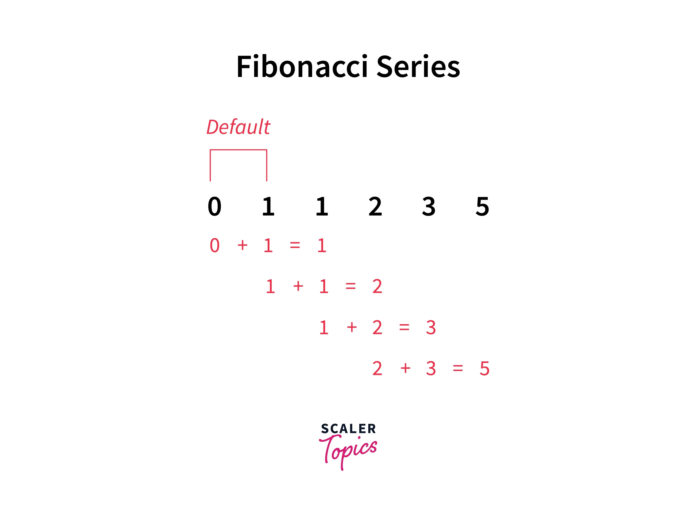

# Fibonacci

> Fibonacci là một dãy số tự nhiên trong đó mỗi số là tổng của hai số liền trước nó. 

- `input` : random number (số thứ tự của dãy fibonacci bắt đầu từ 0)
- `output` : fibonacci of number

