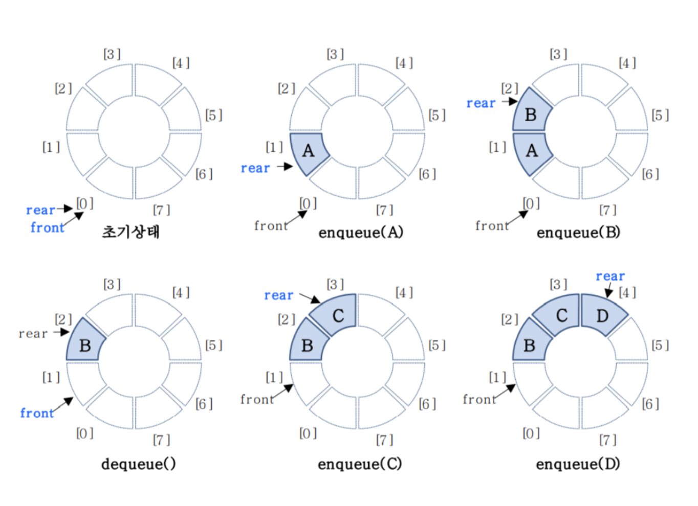
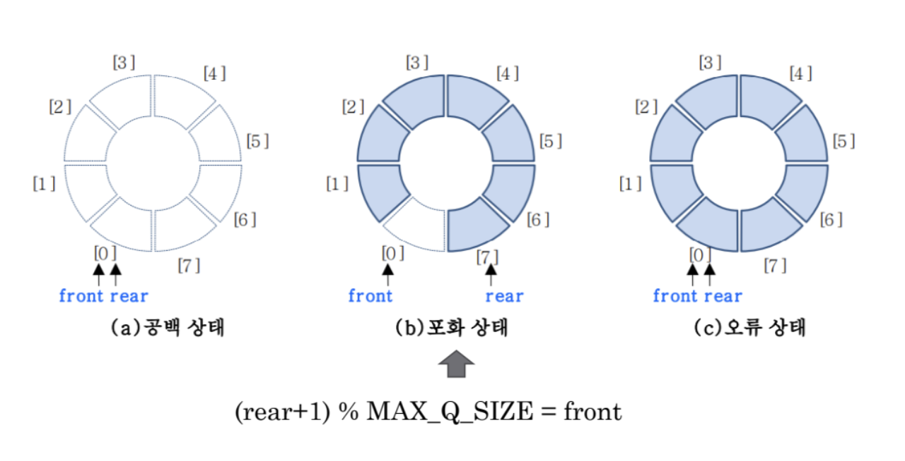
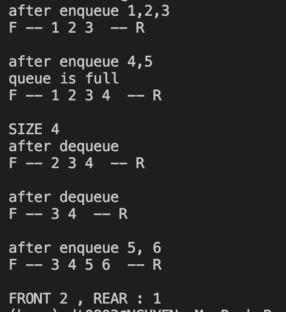

# Circle Queue
- Triển khai hàng đợi bằng cách sử dụng mảng làm vòng tròn
- Cấu trúc vòng tròn được kết nối bởi đàu và cuối của mảng
    

- Điều kiện : Luôn để trống khoảng trống được trở bỏi front
- Trạng thái :
    + rỗng : front == rear
    + bão hòa : front == (rear+1) % MAX_Q_SIZE
    

- Implement:
    + init : front = rear = 1
    + enqueue: rear = (rear+1) % MAX_Q_SIZE
    + dequeue: front = (front+1) % MAX_Q_SIZE
    
