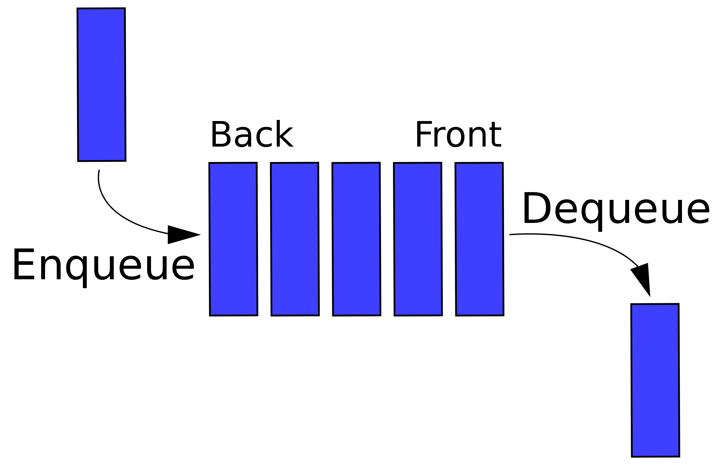
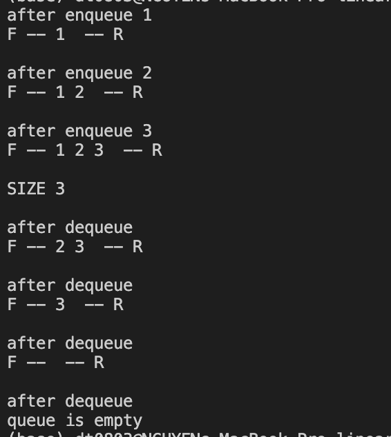

# Linear Queue (First In First Out)
- Queue (hàng đợi) là một cấu trúc dữ liệu rất phổ biến trong khoa học máy tính và lập trình. Nó hoạt động dựa trên nguyên tắc "First In, First Out" (FIFO). Tức, phần tử đầu tiên được thêm vào queue cũng sẽ là phần tử đầu tiên bị xóa
- Hạn chế : kích thước tối đa của linear queue phải được dự đoán trước vì nó cố định (Ko thể thay đổi trong quá trình thực thi)
        + Không thể enqueue khi queue đầy , cho dù có dequeue nhiều lần 

    

- Result
    
