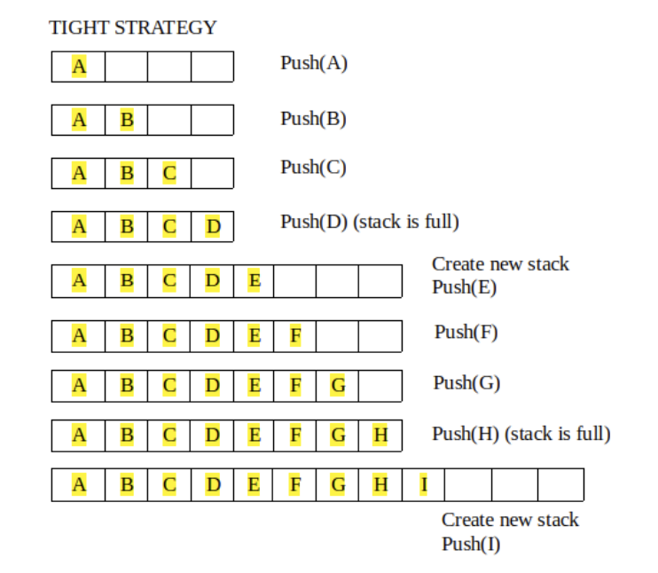
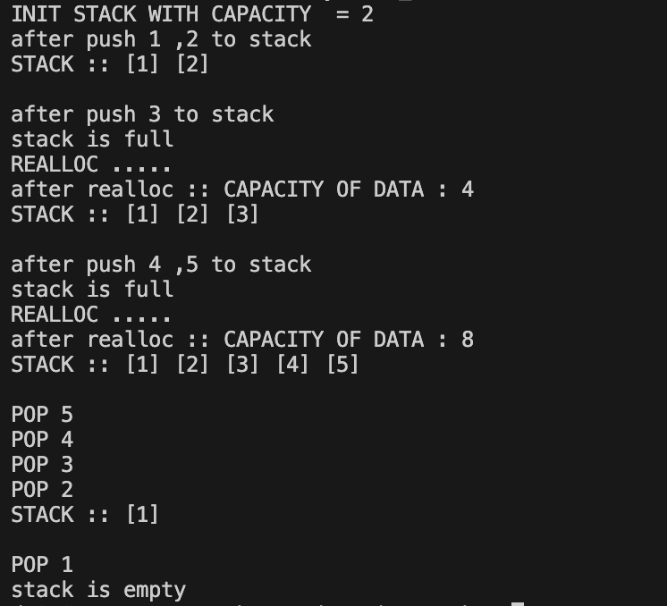

# Dynamic Stack 

- `Dynamic stack` : Khi sử dụng mảng một chiều, cần biết kích thước cố định của ngăn xếp --> nếu kích thước mảng quá nhỏ có thể thiếu , kích thước mảng quá lớn thì lãng phí memory

- `Phương pháp` : Tự động tăng kích thước của ngăn xếp thông qua cấp phát bộ nhớ động (malloc(), realloc()) --> mảng sẽ không cố định kích thước
    - Một mảng có kích thước có thể thay đổi trong thời gian chạy hơn là ở giai đoạn biên dịch.

- `*realloc( void * ptr, size_t size )`: Thay đổi kích thước bộ nhớ được cấp phát động bằng malloc()
    - Dùng để giảm hoặc mở rộng kích thước bộ nhớ

- `Implement`:
    - Khi push 1 phần tử vào trong stack , kiểm tra xem kích thước mảng nếu full sẽ cấp phát động(malloc, relloc) 1 kích thước mới bằng cách nhân đôi kích thước cũ , sau đó mới thực hiện push

- Result

