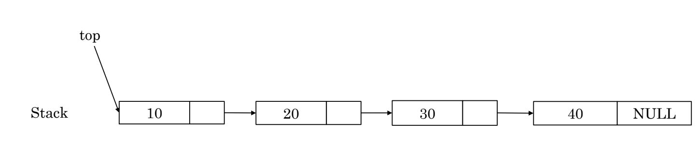
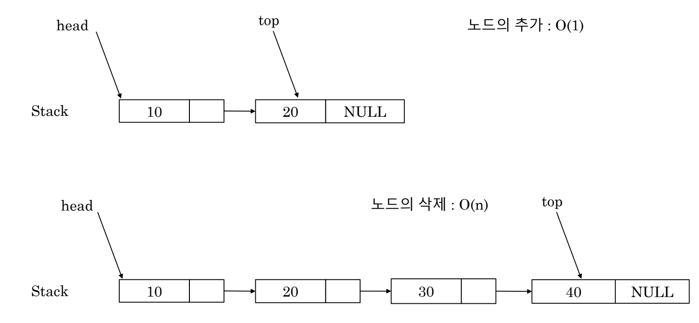
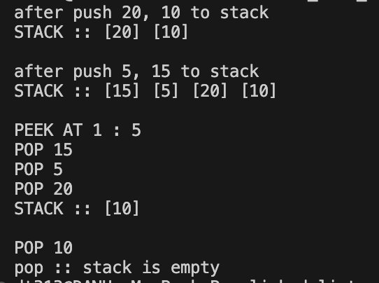

# Stack using Linked List

- stack được triển khai dưới dạng linked list thay vì mảng
- Nhìn từ bên ngoài thì không có gì khác biệt so với ngăn xếp sử dụng mảng
- Ưu điểm là kích thước không bị giới hạn

- top của stack là phần tử đầu tiên của linked list
    - Vì việc push và pop chỉ được thực hiện tại các vị trí cụ thể nên không cần phải có head pointer.
    - Mỗi thao tác trên stack là O(1).
    

- Nếu top của stack là phần tử cuối của linked list
    

- Result
