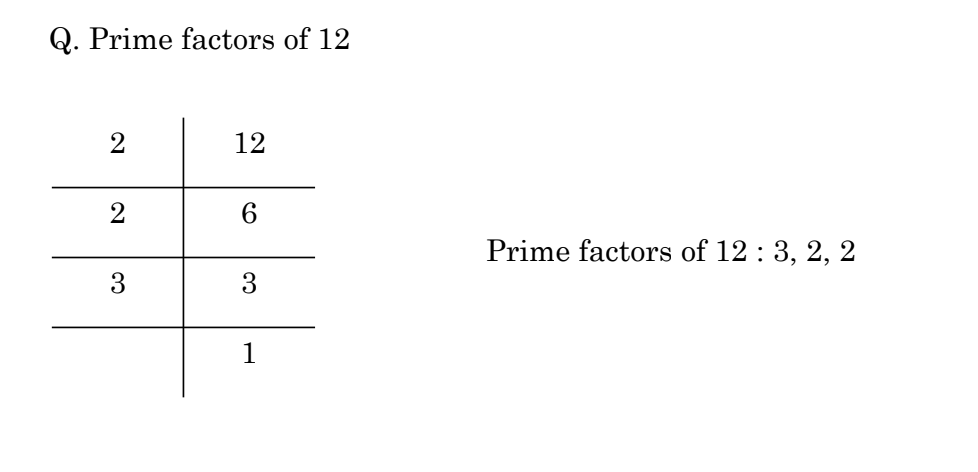
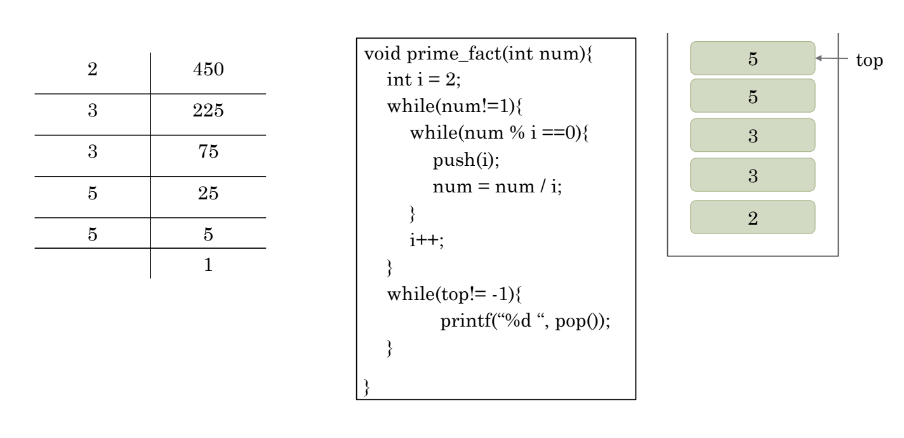
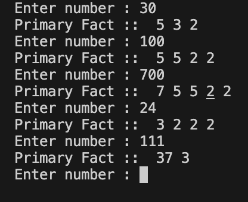

# Prime Factorization using Stack

-  Bài toán phân tích số nguyên tố là quá trình phân tích một số tự nhiên thành tích của các số nguyên tố.
Ví dụ : 60 = 2 * 2 * 3 * 5

- Implement:
    + Chia số tự nhiên cho các số nguyên tố từ nhỏ đến lớn cho đến khi kết quả cuối cùng là một số nguyên tố.
        + nếu số tự nhiên chia hết cho 1 số nguyên tố , push vào stack

