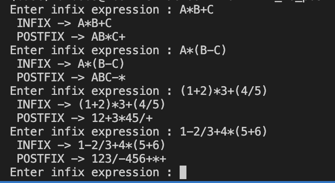

# Infix to Postfix

- Bài toán chuyển đổi biểu thức từ infix sang postfix sử dụng stack
- Ví dụ : (infix) A + (B - C) --> (postfix) ABC-+
- Lợi ích của biểu diễn biểu thức theo postfix :

  - Cách tốt nhất để máy tính tính toán biểu thức
  - Dễ dàng hơn biểu diễn infix vì không cần xem xét dấu ngoặc
  - Tính bằng cách quét từ trái sang phải

- Implement :
  - Khi gặp một toán hạng, in ra (hoặc lưu vào biến)
  - Khi gặp một toán tử, nó sẽ được chèn vào stack.
  - Nếu các toán tử đã có trong ngăn xếp có mức độ ưu tiên bằng hoặc cao hơn toán tử hiện tại
    - pop toán tử
    - push toán tử hiện tại
  - Khi lặp qua hết biểu thức, hãy pop cho đến khi stack empty
- Result:
  
