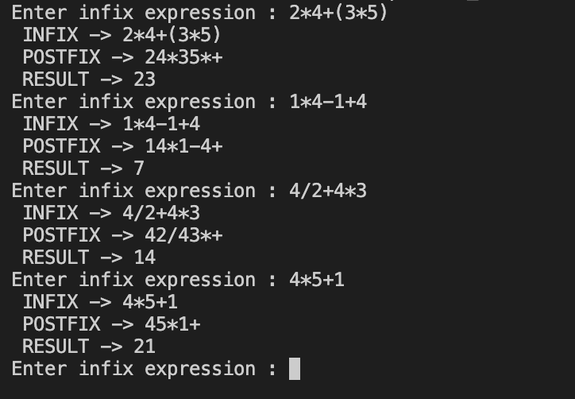

# Postfix Calucation
- Tính toán theo biểu thức posfix sử dụng stack
  - Ví dụ : `infix` 3 + (2 - 1) --> `postfix` 321-+ --> `after calculate:` 3

- output : keets
- Implement :
  + input : infix 
  + đổi ra postfix
  + hàm tính toán sẽ nhận postfix
    + Nếu là toán hạng (1,2,3...,9) thì push vào stack 
    + Nếu là toán tử pop 2 toán hạng từ stack --> tính toán + --> lưu kết quả vào stack
    + trả về kết quả

- Result:
  
