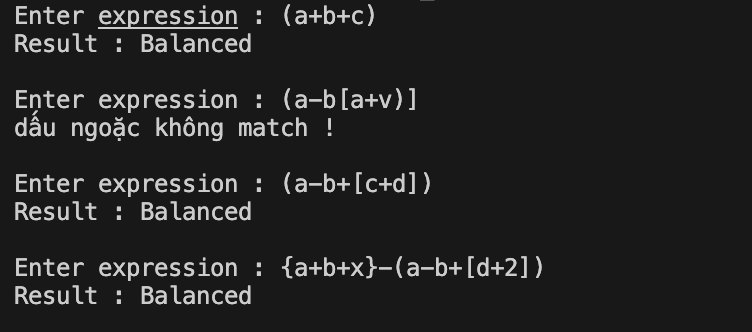

# Kiểm tra dấu ngoặc sử dụng stack
- Dấu ngoặc phải luôn được sử dụng theo cặp.
- Kiểm tra xem dấu ngoặc đơn trong biểu thức nhập có được sử dụng đúng hay không
- Điều kiện :
    + Số dấu ngoặc trái phải bằng số dấu ngoặc phải.
    + Trong cùng một loại dấu ngoặc , dấu ngoặc bên trái phải đứng trước dấu ngoặc đơn bên phải.
    + Các cặp dấu ngoặc trái và dấu ngoặc phải khác loại không được giao nhau (vd : `[(])` )

- Các loại dấu ngoặc : `()`, `[]`, `{}`

- Ví dụ :
    + `[A - B + C]` --> valid
    + `[A - (B + C)]` --> valid
    + `[A - (B + C]` --> invalid
    + `{(A+B) 2 (C % D)}` --> valid
    + `[A/B 2 (C *D ) + (E-F]` //invalid

- Implement :
    + push dấu ngoặc mở vào stack
    + nếu xuất hiện dấu ngoặc đóng :
        + pop dấu ngoặc từ stack
        + so sánh 2 dấu ngoặc có cùng loại hay không
    + cuối cùng không còn dấu ngoặc nào trong stack thì valid;

- Result :
    
