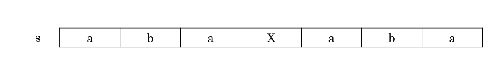
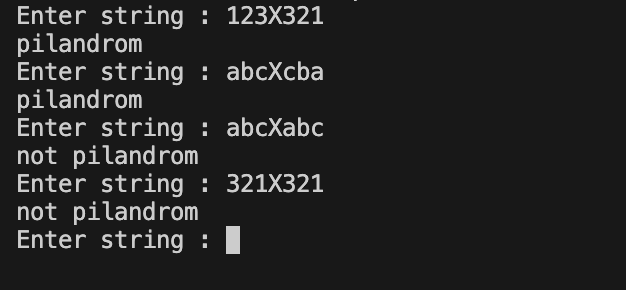

# Check Palindrom using stack
- Palindrom là một chuỗi mà khi đọc ngược lại vẫn giống như khi đọc xuôi.
    
- có nhiều cách để triển khai bào toán check palidrom , đây chỉ là ví dụ để thực hành stack

- Implement :
    + Giả sử 2 phần của palindrom được phân tách bằng chữ X
    + ví dụ : abcXcba
    + push tất cả kí tự trước X vào stack
    + so sánh từng kí tự sau X với từng phần tử trong stack bằng cách pop

- Result:
    

